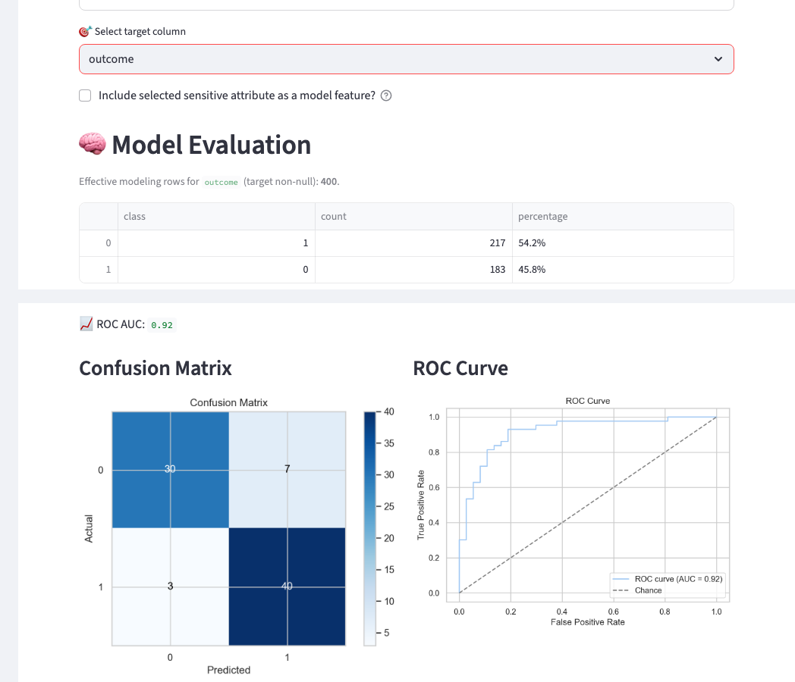
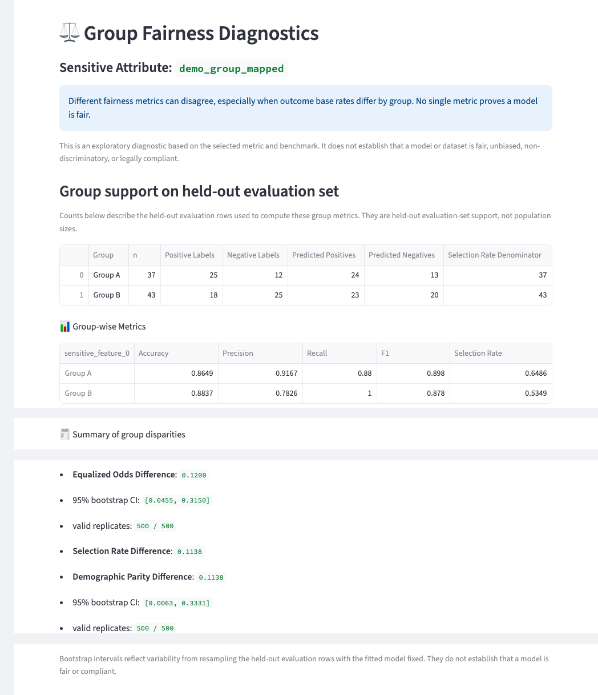

# 🧮 ABDI — Bias Audit Tool

**Exploratory bias and fairness diagnostics for tabular datasets using Fairlearn and scikit-learn. Streamlit app with a synthetic demo only — not a fairness verdict or compliance determination.**

[](https://github.com/nabinkim0318/abdi/actions/workflows/ci.yaml)
[](https://www.python.org/)
[](https://streamlit.io/)
[](https://fairlearn.org/)
[](LICENSE)

**Live demo:** [abdi-bias-audit.streamlit.app](https://abdi-bias-audit.streamlit.app/) — hosted on Streamlit Community Cloud. See [Try the demo](#try-the-demo) below, or run it locally with `make install && make run`.

> ABDI is an exploratory diagnostic tool. Reported disparities and bootstrap intervals do not establish that a model is fair, unbiased, non-discriminatory, or legally compliant — see [Scope limits](#scope-limits).

The bundled demo dataset is fully synthetic. See [DATA_PROVENANCE.md](DATA_PROVENANCE.md). User-uploaded datasets are supplied by the user and may contain sensitive information. The bundled repository demo itself is synthetic.

## Screenshots

Both screenshots come from a real local run of `app.py` against the committed synthetic demo (`bias_audit_tool/sample_data/demo.csv`), sensitive attribute `demo_group_mapped`, target `outcome`.

**Input and model evaluation** — target selection, held-out ROC AUC, confusion matrix, and ROC curve.



**Group fairness diagnostics** — sensitive attribute, the exploratory-diagnostic caveat, held-out group support, and Demographic Parity / Equalized Odds differences with bootstrap intervals.



## Why this project

Fairness metrics can be misleading when preprocessing leaks information, sensitive attributes are handled inconsistently, groups are very small, or metric uncertainty is hidden. ABDI demonstrates a more defensible exploratory workflow by pairing Fairlearn metrics with held-out evaluation, group-support context, explicit caveats, and reproducible data/CI.

## Key capabilities

- **Leakage-safe modeling** — preprocessing transformers are fit on the training split only.
- **Fairness diagnostics** — Fairlearn Demographic Parity Difference and Equalized Odds Difference computed on held-out predictions.
- **Uncertainty context** — held-out group support counts, sparse-support warnings, and percentile bootstrap intervals with the fitted model fixed.
- **Sensitive-feature controls** — the selected sensitive attribute and its direct encodings are excluded from model features by default, and can be opted back in.
- **Data guardrails** — duplicate CSV headers, non-finite values, tiny datasets, weak class support, and extreme imbalance are surfaced before modeling.
- **Reproducibility** — a synthetic demo fixture, a generated `requirements.txt` contract, fresh-environment CI, and a deterministic demo generator.

### Try the demo

1. Open the [live app](https://abdi-bias-audit.streamlit.app/) (or run it locally with `make run`).
2. Upload `bias_audit_tool/sample_data/demo.csv`.
3. Select `demo_group_mapped` as the sensitive attribute.
4. Paste the benchmark from `bias_audit_tool/sample_data/demo_benchmark.json`.
5. Enable modeling and select `outcome` as the target.

See [Demo walkthrough](#demo-walkthrough-synthetic-csv) below for the full step-by-step, including what each output means.

---

## 🚀 Features

- CSV upload and preprocessing recommendations, with a processed-data preview and CSV download
- Candidate sensitive attributes based on column-name and metadata heuristics — review before use
- User-supplied expected-distribution (benchmark) representation analysis
- Binary-classification modeling with train-only-fitted preprocessing
- Optional inclusion or exclusion of the selected sensitive attribute, including its direct encodings, as a model feature
- Held-out classification metrics, ROC AUC, a confusion matrix, an ROC curve, and permutation feature importance
- Group-wise fairness diagnostics, including Demographic Parity Difference and Equalized Odds Difference
- Held-out group support counts and sparse-group warnings accompany model fairness metrics
- Percentile-bootstrap uncertainty intervals for Demographic Parity Difference and Equalized Odds Difference, conditional on the fitted model and held-out predictions
- Input guardrails detect duplicate CSV headers and non-finite numeric values before modeling.
- The binary modeling path checks minimum dataset/class support and warns on extreme class imbalance.
- Uploaded datasets are tracked by content fingerprint so changed files with reused filenames do not reuse stale analysis state.
- Count-plot visualizations for selected grouping columns and observed-vs-expected distribution charts

### Scope limits

- Exploratory diagnostic only — not a legal, regulatory, or compliance determination
- Supervised modeling is binary classification only
- One selected sensitive attribute is audited at a time
- Group-support thresholds and bootstrap intervals are descriptive stability diagnostics, not fairness or compliance determinations
- Sensitive-attribute recommendations are heuristic and require human review
- Excluding the selected attribute removes its direct encodings, but does not remove proxy variables
- Benchmark-relative representation analysis requires a user-supplied expected distribution
- Duplicate headers, non-finite numeric values, and below-minimum class/row support block modeling; they are not auto-repaired
- Extreme class imbalance produces a heuristic warning only — classes are not resampled and thresholds are not changed

## Architecture

```text
CSV
 ↓
Input validation
 ↓
Exploratory preprocessing UI
 ↓
Train/test split
 ↓
Train-only preprocessing
 ↓
Classifier
 ↓
Held-out evaluation
 ├─ classification metrics / ROC / confusion matrix
 └─ Fairlearn group diagnostics
      ├─ group support
      └─ bootstrap uncertainty
```

## Testing & reproducibility

CI runs three independent jobs on every push and pull request:

- **lint-and-test** — Ruff, Black, pre-commit hooks, and the pytest suite, all under Poetry.
- **Requirements drift** — `poetry check --lock`, then a diff between the committed `requirements.txt` and a fresh `poetry export`.
- **Fresh Environment Reproducibility** — a clean `pip install -r requirements.txt`, an import smoke test, and a bounded headless Streamlit startup.

Run the same checks locally:

```bash
make test
make precommit
make check-requirements
```

---

## 🛠️ Installation

`pyproject.toml` is the declared dependency source. `poetry.lock` pins the
resolved development graph. `requirements.txt` is a generated runtime
install artifact for a clean Python environment — do not edit it by hand.

CI verifies both the Poetry development environment (lint, hooks, pytest)
and a clean Python 3.12 `pip install -r requirements.txt` runtime
installation (import smoke and a bounded headless Streamlit startup).

### Developer install (Poetry)

```bash
git clone https://github.com/nabinkim0318/abdi.git
cd abdi
```

Install Poetry if needed:

```bash
curl -sSL https://install.python-poetry.org | python3 -
```

```bash
make install
make run
```

`make install` runs `poetry install --with dev` and installs pre-commit
hooks from that Poetry environment. Do not activate a Poetry shell;
`make run`, `make test`, and `make lint` already use `poetry run`.

### Runtime / deployment install

From a clean Python 3.12 environment, using the committed checkout:

```bash
python -m pip install -r requirements.txt
streamlit run app.py
```

This path is what the Fresh Environment Reproducibility CI job checks. It
does not install pytest, pre-commit, Black, or Ruff.

### Deploying your own live demo

The hosted demo above runs on [Streamlit Community
Cloud](https://streamlit.io/cloud). `app.py` is a single-file Streamlit entry
point that reads the committed `requirements.txt`, so a fork deploys with no
code changes:

1. Go to [share.streamlit.io](https://share.streamlit.io) and sign in with GitHub.
2. Click **New app**, then pick your fork, branch `main`, and main file `app.py`.
3. Deploy. Streamlit Community Cloud installs directly from the committed
   `requirements.txt` on Python 3.12 — the same runtime path the Fresh
   Environment Reproducibility CI job checks.

### Regenerating requirements.txt

Requires Poetry 2.x. Poetry 2 needs `poetry-plugin-export`; `make
requirements` installs `poetry-plugin-export==1.9.0` into that Poetry
installation if `poetry export` is missing.

```bash
make requirements
```

To verify the committed file without writing to the working tree:

```bash
make check-requirements
```

## Demo walkthrough (synthetic CSV)

Use the committed synthetic demo, not any external clinical extract.

1. Start the app (`make run` or `streamlit run app.py`).
2. Upload `bias_audit_tool/sample_data/demo.csv`.
3. Apply the suggested preprocessing, then choose **`demo_group_mapped`** as the sensitive attribute. Exploratory one-hot encoding plus the existing dummy-merge heuristic reconstructs `demo_group` as `demo_group_mapped`. `age_band_*` dummy columns may also appear as candidates because the name contains `age` — use `demo_group_mapped` for this walkthrough.
4. For representation analysis, paste the synthetic demonstration benchmark from `bias_audit_tool/sample_data/demo_benchmark.json` (proportions that sum to 1.0). This is a software fixture, not a population prevalence.
5. Enable modeling and select **`outcome`** as the binary target.
6. Run model evaluation. Inspect the classification report, ROC-AUC, Confusion Matrix, ROC Curve, permutation importance, held-out group support, group-wise fairness diagnostics, DP Difference, EO Difference, and the DP/EO bootstrap intervals.

Do not interpret demo group differences as real-world demographic findings.

## Data provenance

The bundled demo dataset is fully synthetic and generated locally with a
fixed seed. See [DATA_PROVENANCE.md](DATA_PROVENANCE.md) for the generator,
the data dictionary, and the git-history notes on previously removed
external clinical artifacts. User-uploaded datasets are supplied by the
user and may contain sensitive information; this repository makes no
privacy or compliance claims about uploads.

📁 Project Structure
```bash
app.py                             # Streamlit entry point
bias_audit_tool/
├── data/
│   ├── data_loader.py             # CSV loading
│   ├── upload_state.py            # Content-fingerprint session identity
│   └── validation.py              # Header, finite-value, and support checks
├── modeling/
│   ├── fairness.py                # Representation and model fairness metrics
│   ├── model_selector.py          # Baseline classifier training and evaluation
│   └── target_validation.py       # Binary-target checks for the modeling path
├── preprocessing/
│   ├── modeling_pipeline.py       # Leakage-safe train/test modeling pipeline
│   ├── preprocess.py              # Preprocessing recommendations
│   ├── recommend_columns.py       # Heuristic candidate sensitive attributes
│   ├── summary.py                 # Preprocessing recommendation summary table
│   └── transform.py               # Exploratory (full-data) preprocessing
├── sample_data/
│   ├── demo.csv                   # Synthetic portfolio demo (see DATA_PROVENANCE.md)
│   └── demo_benchmark.json        # Synthetic demonstration benchmark
├── utils/
│   └── ui_helpers.py              # Streamlit helpers for preprocessing and modeling
├── visualization/
│   ├── ui_blocks.py               # Representation-audit UI
│   ├── visualization.py           # Live charts
│   └── evaluation_plots.py        # Held-out confusion matrix and ROC figures

tests/
├── test_fairness.py
├── test_fairness_bootstrap.py
├── test_group_support.py
├── test_model_evaluation_plots.py
├── test_modeling_pipeline.py
├── test_preprocess.py
├── test_product_surface.py
├── test_recommend_columns.py
├── test_synthetic_demo.py
├── test_target_validation.py
├── test_data_validation.py
├── test_upload_state.py

scripts/
├── generate_demo_data.py          # Deterministic synthetic demo generator (seed 42)
├── requirements-contract.sh       # Export/check runtime requirements.txt
├── runtime_import_smoke.py        # Clean-env application import smoke
└── streamlit_startup_smoke.py     # Bounded headless Streamlit startup smoke

docs/
└── assets/                        # README screenshots (synthetic demo only)

Makefile                           # Common tasks: install, run, lint, test, requirements
pyproject.toml                     # Declared dependencies and build settings
poetry.lock                        # Resolved Poetry dependency graph
requirements.txt                   # Generated runtime install artifact
README.md                          # This file
DATA_PROVENANCE.md                 # Synthetic demo provenance and data dictionary
LICENSE                            # MIT License
```
